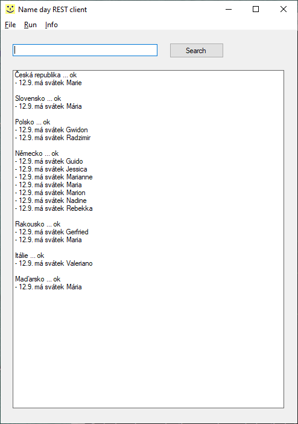

# Name day REST client
The C# Windows Forms GUI application for finding name days for the name or for the date built by the .NET Framework. It is the client that communicates using JSONs with my own name day REST service.

For the operation there must be any **name** or **date** in the text field written.

## Versions
The tested version of .NET Framework is **4.0.30319**.

The current path of **C# compiler** for the compilation is **C:\WINDOWS\Microsoft.NET\Framework\v4.0.30319**. If You want to set any other path, please change the line `set DOTNET_HOME=C:\WINDOWS\Microsoft.NET\Framework\v4.0.30319` of *_make.cmd* batch.

The version of **included Newtonsoft.Json DLL** is **12.0.0.0** ([Newtonsoft.Json.dll] is required for the REST communication with my service).

This project also show the example how to develop a small .NET application without Microsoft Visual Studio.

### Cloning to your computer
- install [GIT] on your computer
- clone this repository to your computer by the GIT command `git clone https://github.com/petrfaltus/csharp-nameday-rest-client.git`

### Running under Windows
- the batch *_make.cmd* compiles the project, it creates the **EXE** file (**Windows executable**)
- the batch *_run.cmd* launches the Windows executable file in the **bin** directory (it requires the *Newtonsoft.Json.dll* placed in the same directory for the operation)
- the batch *_clean.cmd* deletes the Windows executable file in the **bin** directory

## To do (my plans to the future)
- the search functionality should be running in any **other thread** and there should be also the **Stop** button
- there is a little language conflict, the application is pure english but the name days REST service czech

[Newtonsoft.Json.dll]: <https://www.newtonsoft.com/>
[GIT]: <https://git-scm.com/>
